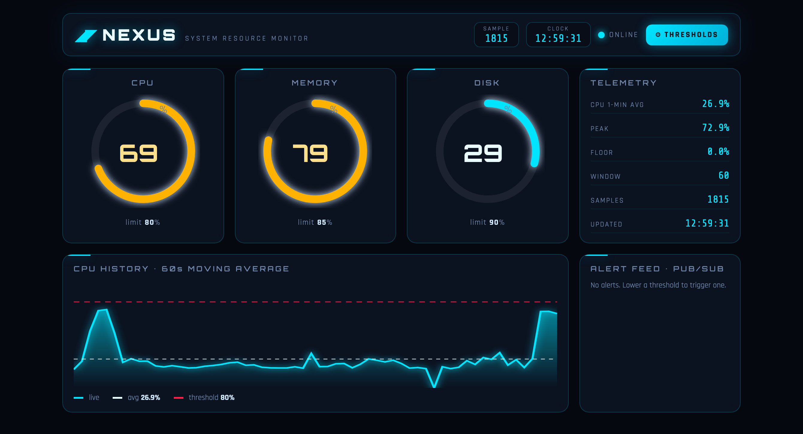
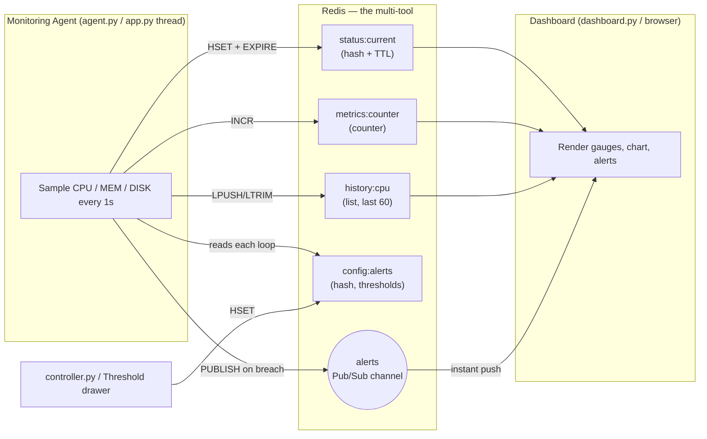
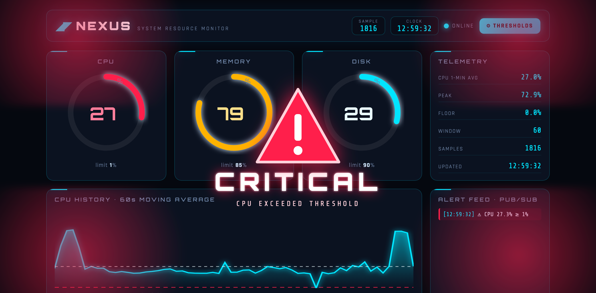
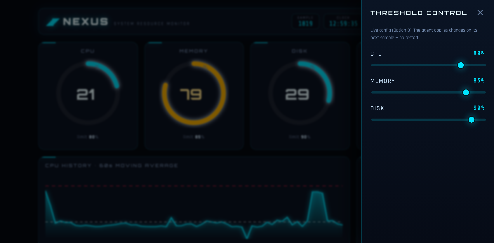
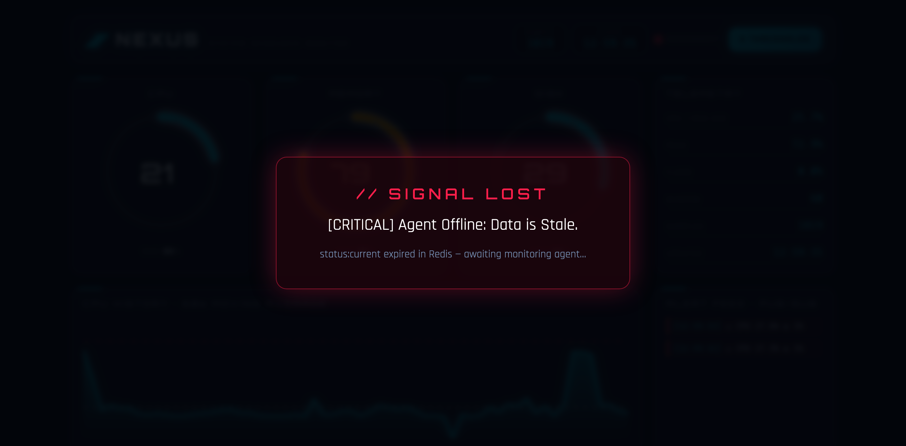

<div align="center">

# NEXUS · Real-Time System Resource Monitor & Alert Dashboard

**A production-inspired system monitor built with Python + Redis**, where Redis is used as a *multi-tool* — a cache, a live configuration store, and a real-time message bus — all at once.




</div>

---

## Table of Contents

- [Overview](#overview)
- [How Redis is used as a multi-tool](#how-redis-is-used-as-a-multi-tool)
- [Architecture](#architecture)
- [Screenshots](#screenshots)
- [Challenge options (all three implemented)](#challenge-options-all-three-implemented)
- [Project structure](#project-structure)
- [Setup](#setup)
- [Running the project](#running-the-project)
- [Redis keys reference](#redis-keys-reference)
- [Short write-up](#short-write-up)

---

## Overview

The system continuously samples the machine's CPU, memory and disk usage, stores
the data in Redis, checks it against configurable thresholds, and broadcasts an
instant alert whenever a limit is breached. It ships in **two equivalent forms**:

| Form | Files | Description |
|------|-------|-------------|
| **Web app** | `app.py` + `templates/` + `static/` | One process runs the agent and serves a futuristic, realtime dashboard in the browser. |
| **Terminal** | `agent.py`, `dashboard.py`, `controller.py` | Classic split: the agent samples, the dashboard renders, the controller tunes thresholds — three programs talking only through Redis. |

Both forms communicate **exclusively through Redis** — no program calls another
directly.

---

## How Redis is used as a multi-tool

Instead of treating Redis as a plain database, the project uses three different
Redis features to solve three different engineering problems:

| Problem | Redis feature | Key / Channel |
|---------|---------------|---------------|
| **Caching volatile data** — keep the latest sample, but let it disappear if the agent dies | **Hash with a TTL** | `status:current` (expires in 3 s) |
| **Dynamic configuration** — change alert limits at runtime without restarting | **Hash** | `config:alerts` |
| **Event-driven messaging** — push alerts the instant they happen | **Publish / Subscribe** | `alerts` channel |
| **Rolling history** — keep the last 60 CPU samples for an average | **List** (`LPUSH` + `LTRIM`) | `history:cpu` |

---

## Architecture



The agent re-reads `config:alerts` on **every** loop, so any threshold change is
applied on the next sample — no restart anywhere in the system.

---

## Screenshots

### Live dashboard
All telemetry on one futuristic screen: three radial gauges (color-coded
green → amber → red), a 60-second CPU history chart with the moving-average and
threshold lines, a telemetry panel, and the live Pub/Sub alert feed.


### Critical alarm
When any resource reaches its limit, a **flashing danger sign** fills the center
of the screen, **red alarm lights pulse** in the background, the breached gauge
glows red, and the alert feed fills with events delivered over Redis Pub/Sub.



### Live threshold control (Option B)
The **⚙ THRESHOLDS** button opens a slide-in panel — the only secondary screen —
with sliders that update `config:alerts` live. The running agent applies the new
limit on its very next sample.



### Graceful degradation (Option C)
If the agent stops and `status:current` expires, the dashboard clears and shows a
prominent **`[CRITICAL] Agent Offline: Data is Stale.`** banner.



---

## Challenge options (all three implemented)

- **Option A — Historical Average Tracker.** The agent keeps the last 60 CPU
  samples with `LPUSH history:cpu` + `LTRIM history:cpu 0 59`. The dashboard
  computes and displays the **1-minute moving average** and renders the live
  history chart.
- **Option B — Configuration Controller.** Thresholds live in the
  `config:alerts` hash and can be changed at runtime — from `controller.py` in
  the terminal, or the **threshold drawer** in the web app. Lowering a limit
  triggers an alert **instantly, without restarting any code**.
- **Option C — Graceful Degradation.** `status:current` carries a 3-second TTL.
  If the agent stops, the key expires, the dashboard detects the missing data
  and shows the **Agent Offline** warning.

---

## Project structure

```
TP_ComputacionI/
├── common.py          # Shared Redis connection + key/channel names ("schema")
├── agent.py           # Monitoring Agent: sample → Redis, check thresholds, publish
├── dashboard.py       # Terminal dashboard: toggleable colour UI + Pub/Sub listener
├── controller.py      # Terminal threshold controller (Option B)
├── app.py             # All-in-one Flask web app (agent thread + realtime dashboard)
├── templates/
│   └── index.html     # Web dashboard markup
├── static/
│   ├── style.css      # Futuristic theme (neon, glass, gauges, alarm animations)
│   └── ui.js          # SSE client, radial gauges, chart, critical mode, drawer
├── requirements.txt
└── docs/              # Screenshots used in this README
```

---

## Setup

> Requires Python 3 and a running Redis instance on `localhost:6379`.

### 1. Install and start Redis (macOS / Homebrew)

```bash
brew install redis
brew services start redis   # start Redis and keep it running
redis-cli ping              # should print: PONG
```

### 2. Install the Python dependencies

```bash
python3 -m venv venv
source venv/bin/activate
pip install -r requirements.txt
```

---

## Running the project

### Option 1 — Web app (recommended)

One process runs the agent **and** serves the dashboard:

```bash
source venv/bin/activate
python app.py
# then open the URL it prints, e.g. http://localhost:5050
```

Port 5000 is usually taken on macOS by AirPlay Receiver, so the app defaults to
**5050**. Override with `PORT=8080 python app.py`.

In the browser everything is visible at once. Click **⚙ THRESHOLDS** to open the
slider panel; drag CPU down to ~5 % to fire the critical alarm on demand.

### Option 2 — Terminal version

Open **separate terminal windows** (activate the venv in each with
`source venv/bin/activate`).

**Terminal 1 — the agent:**

```bash
python agent.py
```

**Terminal 2 — the dashboard** (press `1`–`4` to toggle views, `q` to quit):

```bash
python dashboard.py
```

**Terminal 3 (optional) — change a threshold live:**

```bash
python controller.py
```

#### How to demo each option (terminal)

- **Option A:** let it run ~1 minute, press `3`, watch the moving average.
- **Option B:** with the agent running, run `controller.py`, set the `cpu`
  threshold to `5`, and watch an alert appear within a second.
- **Option C:** stop `agent.py` (Ctrl+C). After ~3 seconds the dashboard shows
  the **Agent Offline** banner because `status:current` expired.

> Use **one** form or the other — running two agents at once would double-count
> the metrics.

---

## Redis keys reference

| Key / Channel | Type | Written by | Purpose |
|---------------|------|------------|---------|
| `status:current` | Hash (TTL 3 s) | agent | Latest CPU/MEM/DISK snapshot; expiry powers Option C |
| `metrics:counter` | String (int) | agent | Total number of samples taken |
| `history:cpu` | List (max 60) | agent | Rolling CPU window for the moving average (Option A) |
| `config:alerts` | Hash | controller / drawer | Live thresholds the agent re-reads each loop (Option B) |
| `alerts` | Pub/Sub channel | agent | Instant alert broadcast to all dashboards |

---

## Short write-up

**Why use a Redis Pub/Sub channel for alerts instead of just checking the key
value in a loop?**

Polling a key in a loop has three problems that Pub/Sub solves:

1. **Latency vs. waste trade-off.** Polling forces a bad choice: poll *often* and
   you hammer Redis with constant `GET`s that mostly return "nothing changed"
   (wasted CPU and network), or poll *rarely* and you add delay before an alert
   is noticed. Pub/Sub is **push-based** — the subscriber is woken the instant
   `PUBLISH` runs, so alerts arrive with near-zero latency and zero busy-work in
   between.

2. **No missed or duplicated events.** A polled value only tells you the
   *current* state. If CPU spikes above the threshold and drops back between two
   polls, the loop never sees it. With Pub/Sub each breach is an explicit
   *event*, so transient spikes aren't lost, and you won't re-fire the same alert
   on every poll just because the value is still high.

3. **Decoupling and fan-out.** Pub/Sub cleanly separates the producer (agent)
   from the consumers (dashboards). Any number of dashboards — or future
   consumers like a logger, an email notifier, or a phone-notification service —
   can subscribe to the same `alerts` channel without the agent knowing or caring
   who is listening. Polling would require every consumer to implement and tune
   its own loop against the data keys.

In short: the cached `status:current` key answers *"what is the value right
now?"*, while the Pub/Sub channel answers *"tell me the moment something goes
wrong"* — and those are genuinely different jobs.
